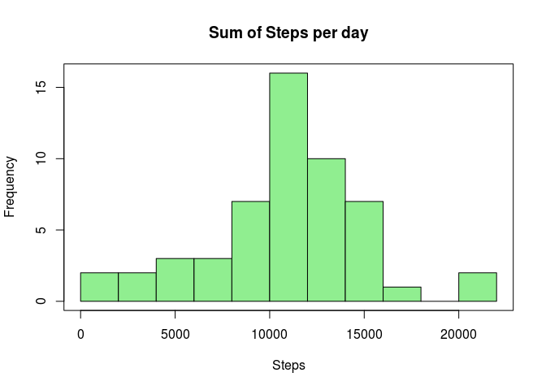
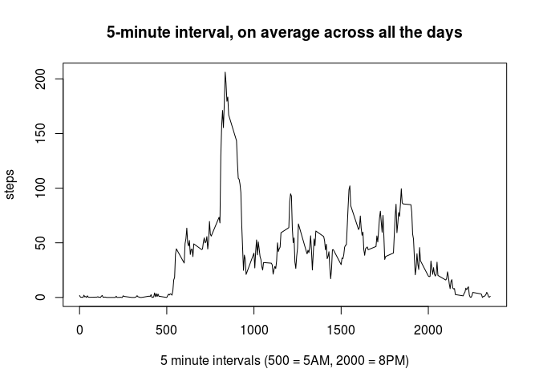
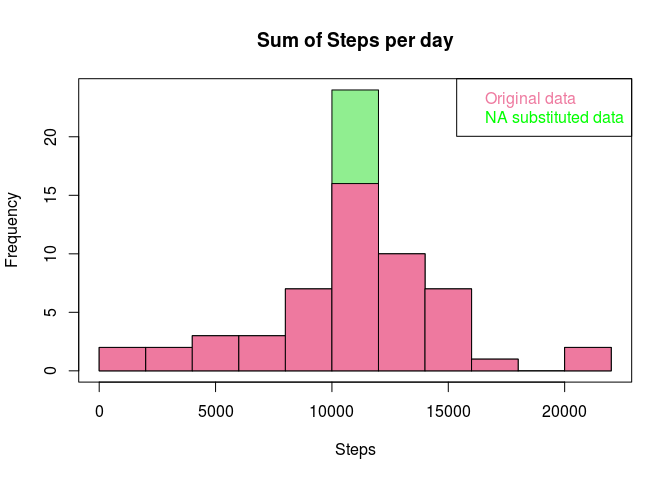
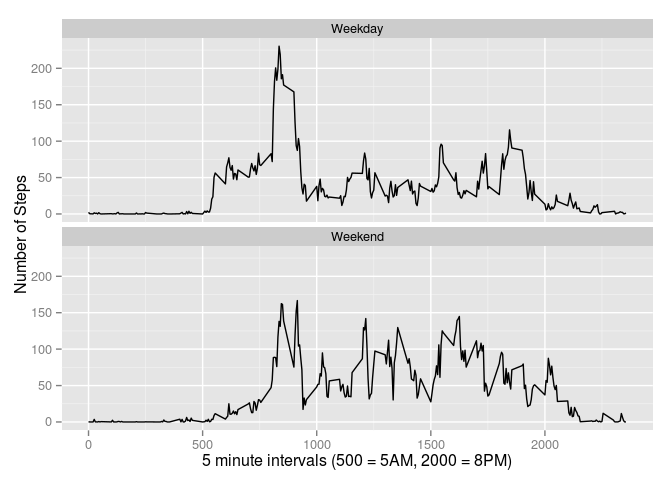

# Reproducible Research: Peer Assessment 1


##Loading and preprocessing the data

```r
options(scipen = 1, digits = 2)
# read data
if(!file.exists("activity.zip")) {
  temp <- tempfile()
  download.file("http://d396qusza40orc.cloudfront.net/repdata%2Fdata%2Factivity.zip",temp)
  act <- read.csv(unz(temp, "activity.csv"),stringsAsFactors = TRUE) 
  unlink(temp)
} else act <- read.csv(unz("activity.zip","activity.csv"),stringsAsFactors = FALSE)
```


##What is mean total number of steps taken per day?

```r
#by date total
ms <- aggregate(steps ~ date,act,sum)
hist(ms$steps,xlab="Steps",
     main = "Sum of Steps per day",
     col="lightgreen",
     breaks=10)
box()
```

 

###Mean and median of the total number of steps taken per day

```r
(originalmean <- mean(ms$steps))
```

```
## [1] 10766
```

```r
(originalmedian <- median(ms$steps))
```

```
## [1] 10765
```

##What is the average daily activity pattern?

```r
intsteps <- aggregate(steps ~ interval, act, mean)
plot(intsteps,type="l",xlab="5 minute intervals (500 = 5AM, 2000 = 8PM)",
     main ="5-minute interval, on average across all the days")
```

 

###Which 5-minute interval, on average across all the days in the dataset, contains the maximum number of steps?

```r
intsteps[max(intsteps$steps),"interval"]
```

```
## [1] 1705
```

Max 5-minute interval = 1705

##Imputing missing values
###Calculate and report the total number of missing values in the dataset (i.e. the total number of rows with NAs)

```r
sum(!complete.cases(act))
```

```
## [1] 2304
```
###Create a new dataset that is equal to the original dataset but with the missing data filled in.
####For this exercise fill in na's with mean for the given 5-minute interval


```r
#fillin missing steps with interval average
tract <- act
tract$steps <- ifelse(is.na(act$steps),intsteps$steps[match(act$interval, intsteps$interval)],act$steps)
```
###Make a histogram of the total number of steps taken each day  


```r
ms1 <- aggregate(steps ~ date,tract,sum)
hist(ms1$steps,xlab="Steps",main = "Sum of Steps per day",col="lightgreen",breaks=10)
hist(ms$steps,col="palevioletred2",add=T,breaks=10)
legend("topright",c("Original data","NA substituted data"), text.col=(c("palevioletred2","green")))
box()
```

 

####Calculate and report the mean and median total number of steps taken per day

```r
(substituteddatamean <- mean(ms1$steps))
```

```
## [1] 10766
```

```r
(substituteddatamedian <- median(ms1$steps))
```

```
## [1] 10766
```
####Do these values differ from the estimates from the first part of the assignment?
As can be seen in the following calculation the mean did not vary and the median slightly varied.

```r
originalmean-substituteddatamean
```

```
## [1] 0
```

```r
originalmedian-substituteddatamedian
```

```
## [1] -1.2
```
####What is the impact of imputing missing data on the estimates of the total daily number of steps?
As can be seen in the overlayed histogram, the biggest impact is a higher center bar (more data at the center of the distribution) which did little to affect it's measures of center.

##Are there differences in activity patterns between weekdays and weekends?
The following panel plots show the weekend has more activity throughout the day while weekdays have an initial surge of activity early in the day.

```r
library(ggplot2)
# set factor variable for weekday/weekend
tract$day <- ifelse(grepl("Sat|Sun", weekdays(as.Date(tract$date))),"Weekend","Weekday")
#summarize mean steps by interval for weekdays
mstractweekdays <- subset(tract,tract$day == "Weekday")
mstractweekdaysa <- aggregate(steps~interval,mstractweekdays,mean)
#summarize mean steps by interval for weekends
mstractweekends <- subset(tract,tract$day == "Weekend")
mstractweekendsa <- aggregate(steps~interval,mstractweekends,mean)
#Set the day variable (weekend/weekday) for the new subsets 
mstractweekendsa$day <- "Weekend"
mstractweekdaysa$day <- "Weekday"
#put the summarized data back in one dataset
merged <- rbind(mstractweekdaysa,mstractweekendsa)
#make the panel plot
p <- ggplot(data = merged, aes(x=interval, y=steps)) 
p <- p + geom_line() + ylab("Number of Steps")
p <- p + xlab("5 minute intervals (500 = 5AM, 2000 = 8PM)")
p <- p + facet_wrap(~day, nrow=2)
print(p)
```

 


